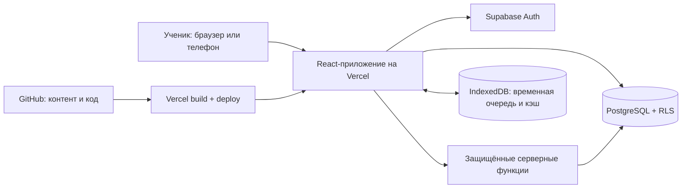

# SRPSKILAB 2.0 — ПОЛНОЕ ТЕХНИЧЕСКОЕ ЗАДАНИЕ

**Документ:** Product Requirements Document + Technical Specification\
**Версия:** 2.1 / 29.09.2026\
**Изменения v2.1:** гарантированная озвучка опубликованного сербского контента и обязательное последовательное открытие уроков по подтверждённому результату.\
**Продукт:** интерактивная платформа изучения сербского языка A0–B2\
**Исходный проект:** `https://github.com/Strannuk87/SrpskiLab` (приватный репозиторий; наличие и содержимое удалённого репозитория при составлении ТЗ не проверялись)\
**Язык интерфейса:** русский; изучаемый язык — сербский, преимущественно экавица; сербская латиница и кириллица.\
**Статус документа:** требования к будущей реализации, не утверждение о том, что функции уже существуют.

---

## 1. ИСХОДНОЕ СОСТОЯНИЕ И ПОДХОД К МИГРАЦИИ

По предоставленному архиву и README исходная версия — статический сайт на HTML/CSS/JavaScript без обязательной серверной части. Изученные файлы: `index.html`, `app.js`, `style.css`, `curriculum-core.js`, `curriculum-a0-a1.js`, `curriculum-a2.js`, `curriculum-b1-b2.js`, `lesson-addons.js`, `sw.js`, `manifest.webmanifest`, `assets/favicon.svg`.

**Что уже есть:** 265 уроков в 31 модуле, уровни A0/A1/A2/B1/B2, словарь, упражнения, диалоги, автоматические проверки, пять тренировочных экзаменов, интервальные карточки, учёт ошибок, выбор письменности и темы, ручной экспорт/импорт прогресса в JSON, возможность локального офлайн-кеша.

**Критичные ограничения текущей версии:**

1. Нет регистрации и синхронизации между устройствами; единственный источник личных данных — `localStorage` текущего браузера.
2. Имя ученика в исходной инициализации задано как «Кирилл»: для многопользовательского продукта убрать эту персонализацию по умолчанию.
3. Результаты уроков, экзаменов, карточек и событий собраны в один объект `srpskilab_progress_v1`; структура требует миграции, но не удаления.
4. Старые идентификаторы уроков вычисляются по образцу `m1l1`, `m1l2` и т. д. Нельзя слепо менять порядок модулей/уроков до создания карты соответствия ID.
5. Текущие условия зачёта: урок — минимум 70% теста (7 вопросов), внутренний экзамен — минимум 80% (20 вопросов). При миграции не пересчитывать старые результаты по новым правилам задним числом.
6. Часть контента построена из общих слов, примеров и диалогов модуля: **265 записей об уроках не равны 265 независимо выверенным педагогическим сценариям**. Нужен редакторский аудит содержания, особенно B1/B2.
7. Свободная речь сейчас не проходит объективной проверки; браузерный синтез речи зависит от наличия сербского голоса. Онлайн-тесты не подтверждают официальный CEFR-уровень.

**Принцип:** не начинать «с чистого листа» ценой потери содержания и прогресса. Сначала сделать резервную копию репозитория и экспорт данных, затем перенести контент в типизированный слой и параллельно внедрять учётные записи.

---

## 2. ЦЕЛИ И ГРАНИЦЫ

### 2.1. Бизнес-/пользовательская цель

Человек может создать аккаунт, начать изучать сербский, безопасно сохранить результат каждой учебной активности, продолжать с другого устройства, повторять слова и получать понятную картину реального прогресса. Платформа должна работать для нескольких независимых пользователей одновременно.

### 2.2. Обязательные результаты релиза 2.0 (P0)

- Регистрация по email и паролю, подтверждение email, вход, выход, восстановление пароля.
- Личный профиль, настройка письменности, темы, цели занятий и часового пояса.
- Глубокая интеграция имеющегося учебного контента без исчезновения модулей.
- Облачное сохранение завершённых уроков, баллов, числа попыток, текущего места и истории ошибок.
- Сохранение учебных экзаменов, лексики, повторений и дат следующего повторения.
- Синхронизация после повторного входа на другом компьютере или телефоне.
- Бережный импорт старого прогресса `srpskilab_progress_v1`, включая JSON-архив.
- Корректная обработка отсутствия сети и ошибок записи: нельзя показывать «сохранено», если сервер не подтвердил операцию.
- Изоляция персональных данных: пользователь A не может читать или менять данные пользователя B.
- Адаптивный интерфейс и развёртывание из GitHub на Vercel.
- **P0-AUDIO:** воспроизводимое сербское аудио для каждого опубликованного учебного слова, примера и реплики диалога — даже если на устройстве нет установленного голоса `sr-RS`.
- **P0-LOCK:** все ещё не достигнутые уроки заблокированы; каждый следующий открывается только после серверного подтверждения прохождения предыдущего урока. Прямой URL не обходит блокировку.

### 2.3. Желательные функции последующих версий (P1/P2)

- P1: вход Google; социальные функции по отдельному согласию; персональные заметки; достижения; привычки и напоминания; установка на телефон как PWA; **дополнительные студийные записи носителей**, заменяющие или дополняющие базовые P0-аудиодорожки.
- P1: отдельный редактор учебных материалов с версиями, черновиками и публикацией.
- P2: ИИ-проверка свободных ответов, распознавание речи, разговорный тренажёр, персонализированная программа и платные тарифы — **только отдельными задачами** после стабильного релиза 2.0.

### 2.4. Вне объёма P0

Не обещать официальный сертификат CEFR, не принимать платежи, не собирать публичные профили/рейтинги по умолчанию и не обещать автоматическое признание произношения. Платёжная и ИИ-подсистемы не должны быть скрытыми зависимостями регистрации или прохождения курса.

---

## 3. РОЛИ И ПРАВА

| Роль                | Возможности                                                                                                                                           |
| ------------------- | ----------------------------------------------------------------------------------------------------------------------------------------------------- |
| Гость               | Читать описание курса и ограниченные демо-уроки; результаты не синхронизируются; можно начать локально при наличии режима гостя.                      |
| Ученик              | Регистрация, полный курс, тесты, экзамены, личный прогресс, словарь, повторение, настройка профиля, резервные копии, удаление аккаунта.               |
| Редактор (после P0) | Создание и редактирование учебного контента в черновиках, предпросмотр; без доступа к чужим персональным данным.                                      |
| Администратор       | Настройка публикаций, контроль технического состояния и ограниченная служебная аналитика; персональные данные — только при явно обоснованном доступе. |

**Никогда не считать пользователя администратором по данным из браузера.** Роль выдаётся серверной доверенной операцией; проверка доступа выполняется на стороне сервера/БД.

---

## 4. ТЕХНИЧЕСКАЯ АРХИТЕКТУРА

### 4.1. Предлагаемый стек

- Frontend: **React + TypeScript + Vite**, маршрутизация — React Router.
- UI: собственные CSS-токены и компоненты, возможность использовать Tailwind по решению команды; дизайн исходной версии переносится без полной визуальной ломки.
- Данные с сервера: `@supabase/supabase-js` и TanStack Query; формы и валидация — React Hook Form + Zod (или эквивалент, выбранный один раз на старте).
- Авторизация: **Supabase Auth**.
- Основная БД: **Supabase PostgreSQL** с включённой Row Level Security (RLS).
- Хостинг frontend: **Vercel**, интеграция с GitHub `Strannuk87/SrpskiLab` после предоставления нужного доступа.
- Служебная логика, проверка результатов зачётов, удаление аккаунта: серверные функции (Vercel Functions или Supabase Edge Functions). Выбрать одну основную среду и документировать границы.
- Контент P0: типизированные файлы JSON/TypeScript под Git; публичный контент собирается в приложение. **Это источник истины для уроков P0.** База данных хранит персональный прогресс и ссылки на стабильные ID уроков, а не копии каждого урока у каждого пользователя.
- Контент P1: отдельная миграция к CMS/таблицам с версионированием и черновиками. После такого перехода источник истины должен быть один — БД/CMS, а Git хранит экспорт/резервную копию, не конкурирующую рабочую версию.
- Тестирование: Vitest + React Testing Library, Playwright, SQL/RLS-тесты, CI GitHub Actions.

### 4.2. Схема взаимодействия

````

````

**Важно:** публичный URL проекта и publishable/anon key Supabase допустимы в клиенте при корректной настройке доступа. `service_role`, секреты email-провайдера и токены администрирования **никогда** не включать во frontend, публичную сборку или репозиторий.

### 4.3. Пример структуры репозитория

```
SrpskiLab/
├── public/
│   ├── favicon.svg
│   ├── manifest.webmanifest
│   └── audio/                       # проверенные лицензированные записи / заранее созданное TTS-аудио
│       └── manifest.json            # сопоставление content_id → audio assets + версия
├── src/
│   ├── app/                         # точка входа, маршруты, providers
│   ├── pages/                       # страницы
│   ├── features/
│   │   ├── auth/
│   │   ├── onboarding/
│   │   ├── course/
│   │   ├── lesson/
│   │   ├── quiz/
│   │   ├── exams/
│   │   ├── vocabulary/
│   │   ├── spaced-repetition/
│   │   ├── audio/                    # единый плеер, голос, аудиоманифест, ошибки
│   │   ├── course-access/            # статусы и последовательная разблокировка
│   │   ├── progress/
│   │   ├── migration/
│   │   └── profile/
│   ├── entities/                     # lesson, attempt, word, profile
│   ├── shared/
│   │   ├── ui/
│   │   ├── lib/
│   │   ├── api/
│   │   ├── types/
│   │   └── validation/
│   ├── content/                      # исходное наполнение (P0)
│   │   ├── manifest.ts
│   │   ├── a0/
│   │   ├── a1/
│   │   ├── a2/
│   │   ├── b1/
│   │   └── b2/
│   ├── styles/
│   └── main.tsx
├── supabase/
│   ├── migrations/                   # SQL-миграции под версионным контролем
│   └── tests/                        # тесты RLS
├── tests/e2e/
├── scripts/                          # импорт существующего контента
├── docs/                             # ТЗ, модель данных, инструкции, миграции
├── .env.example                      # без настоящих секретов
├── .gitignore
├── vercel.json
├── package.json
└── README.md
```

У каждого модуля должна быть ясная ответственность; не создавать новый гигантский `app.js`. Типы и схемы данных нужны до переноса контента.

### 4.4. Настройки Vercel

- Framework: Vite; build command: `npm run build`; output: `dist`; install: `npm ci`.
- Домен: `*.vercel.app` или свой; production и preview разделены, при необходимости использовать отдельные Supabase-проекты/окружения для разработки и production.
- Для клиентского роутинга SPA настроить rewrite на `index.html`, чтобы прямой переход на `/lesson/:id` не выдавал 404.

`vercel.json`:

```
{
  "rewrites": [
    { "source": "/(.*)", "destination": "/index.html" }
  ]
}
```

Проверить конфликт rewrite с серверными маршрутами/API и настроить исключения либо положиться на приоритет системных путей в выбранной конфигурации.

`.env.example`:

```
VITE_SUPABASE_URL=
VITE_SUPABASE_PUBLISHABLE_KEY=
# Только server-side, никогда не добавлять с префиксом VITE_:
SUPABASE_SERVICE_ROLE_KEY=
```

---

## 5. РЕГИСТРАЦИЯ И ЛИЧНЫЙ КАБИНЕТ

### 5.1. Пользовательские сценарии

**REG-01. Регистрация:** пользователь нажимает «Создать аккаунт», вводит email, пароль и необязательное отображаемое имя, принимает обязательные условия обработки данных; получает письмо подтверждения при включённом email confirmation. Нельзя объявлять регистрацию законченной до успешного ответа Auth; сообщение о проверке email должно быть отдельным состоянием.

**REG-02. Вход:** email/пароль; опционально Google после отдельной настройки OAuth. Отображать загрузку, неверные данные, временную сетевую ошибку и состояние неподтверждённой почты без утечек сведений о наличии чужого аккаунта.

**REG-03. Восстановление:** «Забыли пароль» → письмо → безопасная ссылка → новый пароль → успешный вход. Ссылка должна вести на разрешённый production URL.

**REG-04. Сессия:** после перезагрузки остаётся действительной согласно настройкам провайдера; при истечении refresh-сессии показывается запрос повторного входа без уничтожения несинхронизированной работы.

**REG-05. Выход:** прекращается доступ к защищённым экранам; очищаются персональные данные из UI/локального кэша предыдущего аккаунта.

**REG-06. Несколько устройств:** один и тот же email/аккаунт показывает тот же серверный прогресс; разные аккаунты ни при каких обстоятельствах не смешиваются.

**REG-07. Удаление аккаунта:** подтверждаемое необратимое удаление профиля, прогресса и связанных данных через доверенную серверную функцию; предусмотреть экспорт до удаления. Удаление объекта `auth.users` нельзя реализовывать через публичный клиентский ключ.

**REG-08. Смена email и пароля:** только через механизмы Auth с подтверждениями, когда они требуются; предусмотреть защиту от автоматического связывания чужих аккаунтов по неподтверждённым email.

### 5.2. Профиль

Поля: `display_name` (по умолчанию «Ученик», **не имя автора сайта**), email только для владельца, avatar_url (необязательно), native_language=`ru`, target_language=`sr`, script=`latin|cyrillic`, theme=`light|dark|system`, daily_goal_minutes либо число уроков (выбрать одну каноническую модель с миграцией старой цели), timezone (например, `Europe/Belgrade`), reminders_enabled (false по умолчанию), created_at и updated_at.

Пользователь может изменить имя, тему, письменность, дневную цель, часовой пояс, экспортировать и удалить свои данные. Публичный профиль и публичный прогресс отсутствуют в P0.

### 5.3. Требования к email

Для реального запуска необходимо проверить подтверждение адреса, восстановление пароля, шаблоны и разрешённые redirect URLs. Встроенный тестовый email-сервис Supabase не следует считать производственной инфраструктурой: настроить собственный SMTP-провайдер и проверить лимиты, доставляемость и антиспам до публичной регистрации.

---

## 6. КАРТА СТРАНИЦ И НАВИГАЦИЯ

| Маршрут                   | Содержание                                                      | Доступ              |
| ------------------------- | --------------------------------------------------------------- | ------------------- |
| `/`                       | Лендинг или персональная главная в зависимости от сессии        | Все                 |
| `/auth/sign-up`           | Регистрация                                                     | Гость               |
| `/auth/sign-in`           | Вход                                                            | Гость               |
| `/auth/forgot-password`   | Сброс пароля                                                    | Гость               |
| `/auth/callback`          | Обработка email/OAuth redirect                                  | Все                 |
| `/dashboard`              | Текущий уровень, следующий урок, сегодняшняя задача, повторения | Ученик              |
| `/course`                 | Карта уровней и модулей                                         | Все, демо для гостя |
| `/course/:level`          | Модули уровня                                                   | Ученик              |
| `/module/:id`             | Список уроков и статусы                                         | Ученик              |
| `/lesson/:id`             | Теория → слова → диалог → упражнения → результат                | Ученик              |
| `/review`                 | Интервальные карточки                                           | Ученик              |
| `/dictionary`             | Поиск, фильтры, изученные/новые слова                           | Ученик              |
| `/exams` и `/exam/:level` | Экзамены и история попыток                                      | Ученик              |
| `/progress`               | Аналитика занятий и ошибок                                      | Ученик              |
| `/profile`, `/settings`   | Аккаунт, настройки, управление данными                          | Ученик              |
| `/not-found`              | Понятная страница ошибки                                        | Все                 |

После авторизации возвращать пользователя к запрошенному маршруту или последнему незавершённому уроку; прямой заход по ссылке должен работать после F5. Назад/вперёд браузера не должны обнулять неотправленные формы.

**В курс-каталоге:** визуально различать `completed` (галочка), `available` (активная кнопка), `in_progress` (продолжить), `locked` (иконка замка, подсказка с требованием). Запрещено указывать закрытый маршрут как обычную доступную ссылку.

### 6.1. Главная ученика

Обязательные виджеты: приветствие, уровень, прогресс «X из Y», кнопка «Продолжить урок», повторение сегодня, серия активных дней, недельная активность, последняя ошибка на повторение, ближайшая цель. Пустой профиль нового ученика отображать адекватно; не показывать фальшивые результаты и достижения.

### 6.2. Дизайн

Сохранить узнаваемость SrpskiLab и улучшить адаптивность. Единая система размеров, цветов, состояний (default/hover/focus/disabled/error/success/loading), светлая и тёмная темы, удобная боковая навигация на десктопе и нижняя или выдвижная навигация на телефоне. Размер интерактивных областей — удобный для пальца; поддержка клавиатуры и экранного считывателя; контраст не ниже WCAG AA для основного текста.

Состояния загрузки, отсутствия контента, отсутствия сети, ошибки сервера, сохранения и успешной синхронизации должны быть нарисованы и реализованы, а не заменены пустым экраном.

---

## 7. УЧЕБНЫЙ КУРС И КОНТЕНТ

### 7.1. Сохранить карту программы

| Уровень   | Уроков в исходном плане | Задача                                                           |
| --------- | ----------------------- | ---------------------------------------------------------------- |
| A0        | 20                      | Две письменности, чтение, приветствия, числа и базовые диалоги   |
| A1        | 42                      | Бытовая лексика, настоящее время, описания, магазины и транспорт |
| A2        | 63                      | Падежи, прошедшее/будущее, учреждения, аренда, школа, врач       |
| B1        | 70                      | Продолжительная речь, сложная грамматика, работа, переписка      |
| B2        | 70                      | Дискуссии, профессиональное общение, понимание естественной речи |
| **Всего** | **265**                 | **31 модуль**                                                    |

Количество 265 — исходный план, а не запрет на добавление уроков. Изменения числа уроков должны сопровождаться миграцией ID, а не сдвигом всех существующих ссылок.

### 7.2. Типизированная модель урока

Каждый урок имеет:

- `id` — неизменяемый стабильный идентификатор, в том числе сохранённые старые `m1l1` и т. п.;
- `legacy_id` при необходимости, `module_id`, `level`, `ordinal`, `slug`, `title`, `description`;
- `content_version` (целое число или hash), `status`: `draft|review|published`;
- цели обучения и ожидаемые навыки;
- список необходимых предыдущих тем;
- блоки теории с примерами;
- 8–15 слов/выражений со стабильными `word_id`, переводом, употреблением и, при наличии, аудио;
- диалоги по ролям, русский перевод (скрываемый), описание контекста;
- 3–8 учебных упражнений разных типов и 7+ контрольных вопросов;
- мини-ролевая игра/свободный ответ с честной пометкой о способе проверки;
- практическая задача для жизни в Сербии;
- критерий завершения, советы после ошибок и домашнее задание;
- редакторские метаданные: автор, проверяющий, дата обновления.

Структура не должна зависеть от позиции урока в массиве. Ни один урок не удалять без стратегии переназначения существующих записей `lesson_progress`.

### 7.3. Редакторское качество

1. Провести автоматический аудит всех 265 уроков: пустые поля, дубли, обрывочные русские переводы, неправильная транслитерация, некорректные тестовые пары.
2. Провести ручной аудит A0–A2 и отдельный экспертный аудит B1–B2: для каждого урока нужны уникальные цели и осмысленная практика; повторение допустимо, но должно быть педагогически оправдано.
3. Добавлять примеры повседневного языка Нови-Сада, экавицу, латиницу и кириллицу.
4. Не объявлять успешный компьютерный тест доказательством реального уровня CEFR; говорить «завершена программа уровня» и «пройден учебный экзамен».
5. Сохранять версию контента, с которой была выполнена попытка. Обновление грамматики не должно переписывать историю баллов.
6. Добавить словарь ложных друзей русского и сербского и регулярное повторение ошибок.
7. Юридическая и медицинская лексика — учебный материал, не актуальная консультация по документам или лечению.

---

## 8. ДВИЖОК УРОКА, УПРАЖНЕНИЯ И ЭКЗАМЕНЫ

### 8.1. Состояния урока

`not_started → in_progress → completed` — **только сохраняемые статусы прогресса**. Визуальный статус `locked | available` вычисляется отдельно из серверного прогресса и позиции в учебном маршруте; не сохранять `locked` как независимый источник истины.

На каждом переходе сохранять `last_step`: `theory|vocabulary|dialogue|practice|quiz|result`. При повторном открытии предложить продолжить с сохранённого шага. После завершения урока можно повторить его без потери отметки `completed` и лучшего балла. **Переход к следующему уроку — по правилам раздела 8.6, а не по факту открытия страницы или просмотра теории.**

### 8.2. Упражнения

Поддержать типы: один ответ из нескольких, несколько ответов, ввод слова, перевод фразы, сборка предложения, сопоставление, заполнение пропусков, выбор формы глагола/падежа, чтение и вопросы, аудирование по записи (когда есть записи), диалог/свободный письменный ответ.

У каждой задачи отдельный `exercise_id`, `content_version`, тип, инструкция, допустимые ответы, правило оценки, пояснение ошибки. Ответы и прогресс не зависят от изменяемого номера задания в массиве.

Для открытого ответа отличать `automatically_correct`, `automatically_incorrect` и `needs_manual_review`; не помечать творческое предложение неправильным только потому, что оно не дословно совпадает с шаблоном. На начальных этапах для формализованных задач использовать явно заданные допустимые варианты. Нормализация: пробелы, регистр, поддерживаемая транслитерация; **не стирать смысловые различия** `č/ć`, `đ/dž`, окончания и важную пунктуацию, если она проверяется.

### 8.3. Система оценок

- P0 унаследовать зачёт урока `>=70%`, экзамена `>=80%` и требование завершённых уроков уровня для отметки «программа уровня завершена».
- Неверная попытка сохраняется, не обнуляя ранее пройденный урок.
- Сохранять `first_score`, `last_score`, `best_score`, `attempt_count`, историю ответов и время прохождения (без избыточного слежения).
- Показывать ошибки после проверки (или выбранного режима теста), а не до ответа.
- Для официально значимых наград/рейтингов результаты формализованных задач рассчитывает сервер; клиент не должен иметь возможность отправить произвольные `score=100` или `completed=true` и получить зачёт.
- В P0 можно не вводить антимошеннические меры для всего учебного контента, но любые публичные рейтинги/платные сертификаты потребуют отдельной защиты. Ответы, раскрытые в клиентском коде, нельзя считать секретными.

### 8.4. Экзамены

Пять внутренних экзаменов по текущему плану; 20 заданий или пересмотренное число после педагогического аудита, порог 80%. Запуск, пауза (если допускается), завершение, ошибка сети, повторная попытка, отчёт по темам. Сохранять отдельную попытку и полный снимок версии вопросов. Нельзя автоматически присваивать «реальный B2» по одним тестам без проверки говорения и аудирования.

### 8.5. Разговорный режим

P0: ролевые текстовые диалоги с одним вопросом за раз, подсказки только после попытки. Научиться объяснять ошибки в ответах с заданными вариантами. **Для сербских реплик доступен плеер по требованиям раздела 8.7.** P1: дополнительные студийные записи носителей и проверка письменных ответов преподавателем. P2: ИИ-оценка речи только как рекомендательная обратная связь с сообщением о возможных ошибках модели и явным согласием на отправку пользовательского аудио стороннему провайдеру.

### 8.6. Обязательная последовательная разблокировка уроков (P0-LOCK)

**Однозначная логика курса:** установить для всех опубликованных уроков неизменяемый `course_order` (для стартового каталога: A0 → A1 → A2 → B1 → B2 и внутри уровней по нумерации). `course_order` и стабильные `lesson_id` формируют канонический маршрут. Запрещено выводить порядок из сортировки заголовков, локализации или индекса в изменяемом массиве.

1. Новый пользователь видит **первый урок A0 доступным**, последующие уроки — `locked`. Каталог, названия, описание и количество уроков видны, но кнопка открытия закрытого урока неактивна, рядом значок замка.
2. Доступность очередного урока `N+1` возникает **только после** успешной контрольной части урока `N`: сервер вычислил балл `>=70%`, сохранил попытку и подтвердил `lesson_progress.status='completed'`. Простое чтение, автопереход или локальное значение `completed=true` не открывают новый урок.
3. При результате `<70%` ученик получает разбор ошибок и право повторить тест; следующий урок остаётся закрытым. Не ограничивать число повторных попыток, если нет отдельного педагогического решения.
4. Уже пройденные уроки всегда доступны для чтения, прослушивания и повторного тестирования. Переэкзаменовка с низким баллом не снимает зачёт и не блокирует ранее открытые уроки.
5. **Граница уровней:** после завершения последнего урока уровня становится доступен его внутренний экзамен. **Предлагаемое дополнительное правило для v2.1:** первый урок следующего уровня открывать после зачёта экзамена текущего уровня (`>=80%`). Это правило явно выделить в настройках учебной политики (`require_level_exam_for_next_level=true`), чтобы владелец мог изменить его без миграции пользовательских баллов. Внутри одного уровня предыдущее условие `>=70%` неизменно.
6. При обновлении страницы, logout/login, смене устройства и ручном вводе `/lesson/:id` вычислять право доступа из подтверждённого серверного прогресса и политики курса. Для недоступного урока показать понятный экран «Сначала пройди урок № …» с кнопкой **«Перейти к доступному уроку»**, а не пустую страницу или 404. На кнопках «Следующий урок» проверка доступа обязательна.
7. Во время отсутствия сети открываются ранее подтверждённо доступные и сохранённые в локальном кеше уроки. После локального прохождения нового теста показывать **«Ожидает синхронизации»**; не объявлять новый урок окончательно разблокированным до серверного подтверждения. При возвращении сети произвести идемпотентную синхронизацию и пересчитать доступ.
8. После импорта `srpskilab_progress_v1` сохранить всю честно импортированную историю, включая завершённые уроки вне непрерывной последовательности; вычислить **первый непройденный шаг** и направить туда. Импорт сам по себе не должен удалять старые результаты, но новый закрытый урок не открывать по поддельным произвольным данным клиента.
9. Курс открыт **только по направлению вперёд**: все прошлые `completed` доступны, самый ранний ещё не завершённый урок — `available`, остальные — `locked` (с учётом настраиваемого экзамена на границе уровней). Прогресс и процент освоения считать по зачтённым урокам, не по просмотренным страницам.
10. Защиту реализовать **в маршрутизаторе и на сервере при регистрации зачёта и выдаче защищённого контента**. Если P0 сохраняет весь контент в публичной JS-сборке из Git, это **не защита от чтения файлов через инструменты разработчика**: UI-ограничение соблюдается, но настоящая серверная конфиденциальность закрытых уроков потребует переноса контента в защищённый API. Не обещать «невозможно получить содержимое», пока серверная выдача по правам не внедрена.

**Псевдокод (нормативная логика доступа):**

```
function canOpenLesson(userProgress, orderedLessons, targetLessonId, policy) {
  const i = orderedLessons.findIndex(x => x.id === targetLessonId);
  if (i < 0) return false;
  if (userProgress.completedLessonIds.has(targetLessonId)) return true;
  if (i === 0) return true;
  const previous = orderedLessons[i - 1];
  if (!userProgress.completedLessonIds.has(previous.id)) return false;
  const firstInNewLevel = previous.level !== orderedLessons[i].level;
  if (firstInNewLevel && policy.require_level_exam_for_next_level)
    return userProgress.passedLevelExams.has(previous.level);
  return true;
}
```

Этот предикат разрешает также повторное открытие уже пройденного урока; экран прогресса дополнительно выделяет первый непройденный шаг. **Сервер использует свой проверенный прогресс**, а не `Set`, присланный клиентом.

### 8.7. Гарантированная озвучка сербского контента (P0-AUDIO)

**Цель:** на компьютере и телефоне ученик нажимает ▶ на сербском слове, предложении или реплике диалога и слышит разборчивую **сербскую экавицу** без зависимости от установленного в системе `sr-RS`-синтезатора. Просто вызвать `window.speechSynthesis.speak()` недостаточно.

**Обязательная архитектура:**

1. **Основной источник** — собственные заранее подготовленные аудиофайлы (TTS на качественном сербском голосе либо лицензированные записи носителя) в `public/audio/`, объектном хранилище или CDN с разрешёнными правами на публикацию. Сгенерировать или записать и выверить аудио **до выпуска соответствующего урока**. Секреты и ключи платных TTS-поставщиков использовать только в приватной сборочной операции/на сервере, не в браузере.
2. Каждый опубликованный урок должен иметь рабочее аудио для **всех сербских слов словаря, ключевых предложений и всех реплик диалога**. Для аудирования — полный аудиофайл задания, если такая задача публикуется. Не подменять отсутствие файла синтезатором другого языка.
3. **Резервный режим**: если файл не загрузился, разрешено использовать `speechSynthesis` только когда обнаружен подходящий сербский голос (`sr-RS` или вручную проверенный совместимый сербский). При отсутствии обоих показать «Озвучка сейчас недоступна», транскрипцию и кнопку повторить; не показывать ложный статус успешного воспроизведения.
4. Плеер в словаре, карточках, упражнениях, диалогах и теории: ▶ / пауза / повтор, регулировка скорости (например, 0.75×, 1×, 1.25×), выбор нормального или замедленного воспроизведения, индикатор загрузки/ошибки. Не создавать несколько одновременно кричащих плееров: запуск нового останавливает предыдущий.
5. **Поведению браузеров:** воспроизведение начинается после действия пользователя (нажатия), учитывает запрет autoplay на мобильных устройствах, корректно освобождает объект аудио при смене урока/выходе. Не требовать микрофон для простого прослушивания.
6. Поддерживать латиницу и кириллицу без дублирования записи: аудио связывается с **неизменяемым `audio_id`/`content_id`**, а не со строкой UI, которая может менять письменность. Для омонимов и разного ударения хранить независимые аудио-ID; при необходимости хранить нормы произношения и варианты.
7. Аудиоманифест содержит `audio_id`, `content_id`, `content_version`, `locale=sr-RS`, `script_source`, `audio_url`, `duration_ms` (если известно), `provider/license`, `review_status`. Использовать версии и хэши ресурсов для надёжного кеша после обновлений.
8. **Контроль качества:** автоматически проверять, что каждая опубликованная сербская единица с обязательным аудио имеет валидный файл/URL; выборочно вручную проверять фонетику (č/ć, đ/dž, lj/nj, ударения, экавицу, имена и числительные) и отсутствие обрезания. Ошибка произношения блокирует публикацию до исправления дорожки.
9. **Офлайн:** файлы уже прослушанного или скачанного учеником урока можно сохранять в контролируемый офлайн-кеш по квоте; обещание «всё аудио без интернета» допустимо только после реализации отдельной установки/скачивания пакетов. Обычная онлайн-озвучка должна работать без предварительной установки системного голоса.
10. Добавить в настройки тест звука «Проверить произношение» на реальной сербской фразе и диагностику `audio_ready | loading | unavailable | muted | blocked_by_browser`; объяснять, что нужно включить звук устройства, если аудио физически выключено.
11. **Оплата и лицензии:** оценить размер библиотеки, трафик и стоимость генерации/хранения; определить легальный источник до массовой генерации. Если лицензия запрещает публичную выдачу, такой файл не загружать на Vercel/CDN.
12. Озвучка ≠ проверка речи: распознавание произношения пользователя и доступ к микрофону остаются отдельной будущей функцией и не должны мешать P0.

**Готовность P0:** для каждого урока, обозначенного `published`, все обязательные кнопки озвучки воспроизводят сербский аудиофайл на типовом Windows/Chrome, Android/Chrome и iOS/Safari при включённом звуке и доступном интернете, **даже если системного сербского голоса нет**. Если ресурсов на полный каталог пока нет, такие уроки нельзя заявлять как полностью готовые к релизу; публиковать волнами с честным статусом аудиопокрытия.

---

## 9. СЛОВАРЬ И ИНТЕРВАЛЬНОЕ ПОВТОРЕНИЕ

### 9.1. Данные слова

`word_id`, исходная сербская форма, перевод на русский, примеры, уровень, `audio_id` на проверенную запись согласно 8.7, грамматические пометы, теги, список уроков, содержащих слово.

Не использовать слово в нижнем регистре как единственный ID: одинаковое написание может иметь разные значения, а исправление орфографии не должно стирать интервальную историю.

### 9.2. Состояние слова конкретного ученика

`new → learning → reviewing → mastered` + отдельное число успешных и ошибочных воспроизведений. Простое появление слова в уроке не означает, что ученик его знает.

Начальный совместимый алгоритм SRS: после успешных ответов интервалы примерно **1, 3, 7, 14, 30 дней**; при ошибке — возврат к короткому интервалу и дополнительная тренировка. Дату следующего повторения сохранять в БД в UTC, отображать по часовому поясу пользователя. Важно предусмотреть возможность смены алгоритма (версия расписания) без обнуления существующих слов.

### 9.3. Повторение

- Очередь «сегодня»: просроченные карточки и допустимая порция новых.
- Карточка: слово → самостоятельное воспроизведение → показ ответа → оценка `Не помню / Трудно / Хорошо / Легко` (если четыре оценки приняты окончательно); для совместимости со старой бинарной оценкой использовать отображение `good`/`again`.
- После выбора сохранять событие повторения и серверную новую дату.
- Изученные, избранные, слабые и освоенные слова — отдельные фильтры.
- Словарь, карточки, даты и ошибки синхронизируются по аккаунту.

---

## 10. СТАТИСТИКА И ПЕРСОНАЛЬНЫЙ ПЛАН

Для каждого ученика показывать:

- завершённые уроки/всего, процент по уровню и модулю;
- текущее учебное место, дату последнего занятия;
- календарь занятий, ежедневную цель, количество активных дней подряд;
- суммарные ответы, баллы за тесты, лучший результат и количество попыток;
- количество новых, изучаемых и действительно закреплённых слов;
- слова, которые надо повторить сейчас, и самые частые ошибки;
- динамику за 7/30 дней (по желанию — за весь период);
- внутренние результаты экзаменов, честно обозначенные как учебные.

**Единый источник:** история попыток, состояния уроков и события повторений на сервере. Сводки можно кэшировать, но они не должны создавать новый независимый «прогресс», противоречащий исходным данным. Серии дней считать по пользовательскому часовому поясу; серверные события хранить в UTC и не принимать неверные даты «из будущего» без валидации.

---

## 11. СХЕМА БАЗЫ ДАННЫХ (ПРОЕКТ)

Основная БД — PostgreSQL Supabase. Точная SQL-схема оформляется **версионируемыми миграциями**, а не ручными действиями только в веб-интерфейсе. У всех пользовательских сущностей есть явное `user_id UUID`, ссылающееся на Auth пользователя, и серверные `created_at/updated_at`.

### 11.1. Таблицы P0

| Таблица              | Ключевые поля                                                                                                                                                | Назначение                                                              |
| -------------------- | ------------------------------------------------------------------------------------------------------------------------------------------------------------ | ----------------------------------------------------------------------- |
| `profiles`           | `user_id PK`, `display_name`, `script`, `theme`, `daily_goal`, `timezone`, `created_at`, `updated_at`                                                        | Настройки аккаунта                                                      |
| `lesson_progress`    | `(user_id,lesson_id) PK`, `status`, `best_score`, `last_score`, `attempts_count`, `last_step`, `started_at`, `completed_at`, `updated_at`, `content_version` | Текущий итог по уроку; `locked` вычисляется по 8.6, а не хранится здесь |
| `lesson_attempts`    | `id UUID PK`, `user_id`, `lesson_id`, `attempt_key UNIQUE`, `content_version`, `score`, `passed`, `answers_json`, `submitted_at`                             | Неизменяемая история попыток                                            |
| `exam_attempts`      | `id UUID PK`, `user_id`, `level`, `attempt_key UNIQUE`, `content_version`, `score`, `passed`, `answers_json`, `submitted_at`                                 | История экзаменов                                                       |
| `user_word_progress` | `(user_id,word_id) PK`, `state`, `stage`, `due_at`, `correct_count`, `incorrect_count`, `last_reviewed_at`, `updated_at`                                     | Текущее состояние слов                                                  |
| `word_review_events` | `id UUID PK`, `user_id`, `word_id`, `event_key UNIQUE`, `grade`, `received_at`                                                                               | История и восстановление SRS                                            |
| `learning_events`    | `id UUID PK`, `user_id`, `type`, `lesson_id NULL`, `event_key UNIQUE`, `occurred_at`, `received_at`, `metadata`                                              | Активность/статистика                                                   |
| `user_notes`         | `id UUID PK`, `user_id`, `lesson_id NULL`, `text`, `updated_at`                                                                                              | Личные заметки, если входят в P0                                        |
| `import_jobs`        | `id UUID PK`, `user_id`, `source_version`, `source_hash`, `status`, `summary_json`, `created_at`                                                             | Защита от двойного импорта                                              |

`answers_json` хранит только необходимый учебный результат, без паролей и токенов. Для объёмных ответов предусмотреть ограничение размера и срок хранения. Для часто запрашиваемых полей создать индексы `(user_id, updated_at)`, `(user_id, due_at)`, `(user_id, lesson_id)` и т. п.

**Контент не дублировать в пользовательских таблицах.** `lesson_id` и `word_id` должны ссылаться на стабильный каталог. Если содержимое P0 остаётся в Git, для ссылочной целостности использовать отдельную таблицу-реестр IDs/версий, синхронизируемую миграцией/сидом, либо сознательно реализовать проверку допустимых ID серверной функцией. Не создавать внешний ключ на несуществующую таблицу.

### 11.2. Безопасность и RLS

Для каждой пользовательской таблицы: включить RLS, минимальные SQL grants, отдельные политики `SELECT`, `INSERT`, `UPDATE` и при необходимости `DELETE`. Каждая политика проверяет `auth.uid() = user_id`. При `INSERT/UPDATE` проверять также новый `user_id`, чтобы ученик не перепривязал данные к чужому аккаунту. Записи, которые должен создавать только сервер (результаты экзаменов), не предоставлять клиенту на прямой произвольный `INSERT/UPDATE`.

Условный шаблон для таблицы `profiles`:

```
alter table public.profiles enable row level security;

create policy "profile_select_own"
  on public.profiles for select to authenticated
  using ((select auth.uid()) = user_id);

create policy "profile_insert_own"
  on public.profiles for insert to authenticated
  with check ((select auth.uid()) = user_id);

create policy "profile_update_own"
  on public.profiles for update to authenticated
  using ((select auth.uid()) = user_id)
  with check ((select auth.uid()) = user_id);
```

**Это фрагмент политик, не полный SQL для запуска:** таблица, SQL grants, триггеры, индексы, server-only права и тесты на чужой `user_id` должны быть в отдельных миграциях. Для таблиц попыток не копировать разрешительную модель профиля без анализа возможности подделки результатов.

### 11.3. Правила целостности

- `attempt_key`/`event_key` создаются как UUID на клиенте для идемпотентности и уникальны в рамках пользователя (проектировать составной UNIQUE при необходимости).
- Данные проверяются сервером: `lesson_id` из реестра, `score` 0–100, допустимый `status`, правильный диапазон дат, длина текста и типы JSON.
- **P0-LOCK:** сервер при создании попытки и зачёте урока проверяет доступ по каноническому маршруту (8.6); при успешном зачёте атомарно обновляет прогресс. Браузер не может установить себе `completed` или открыть `N+1` записью в локальное хранилище.
- Завершённый урок не переходит обратно в `in_progress` из-за позднего сообщения другого устройства.
- `best_score` никогда не уменьшается обычной повторной попыткой.
- Количество попыток не увеличивается дважды из-за повтора сетевого запроса.
- `updated_at`/`received_at` проставляются доверенной стороной; клиентские часы используются как вспомогательная информация.

---

## 12. СОХРАНЕНИЕ И СИНХРОНИЗАЦИЯ

### 12.1. Главный инвариант

**Успешно подтверждённый сервером прогресс не теряется** после обновления страницы, выхода из аккаунта, закрытия браузера, входа с другого устройства или повторной отправки того же запроса.

### 12.2. Сценарии

- При входе загружаются профиль, агрегаты уроков, интервальные карточки и последние занятия.
- После успешного теста запись попытки и обновление `lesson_progress` происходят атомарно (в транзакции через серверную функцию/RPC).
- Во время прохождения занятия текущая секция сохраняется с debounce; сервер подтверждает изменение; UI показывает «Сохранено» или «Ожидает синхронизации».
- Если запрос завершился ошибкой, старый результат остаётся; система показывает понятную ошибку и предлагает повторить отправку.
- Обновление на двух устройствах сливается по определённым правилам, а не слепым перезаписыванием всего JSON-профиля.

### 12.3. Объединение данных

| Данные             | Правило                                                                                                                              |
| ------------------ | ------------------------------------------------------------------------------------------------------------------------------------ |
| Завершённые уроки  | `completed` побеждает `in_progress` при обычной синхронизации; снять зачёт можно только отдельным подтверждённым сбросом.            |
| Баллы              | `best_score = max(existing, incoming)`; последняя попытка по серверному порядку хранится отдельно.                                   |
| Попытки            | Объединение по уникальному ID; повторы не увеличивают счётчик.                                                                       |
| Экзамены           | Отдельные попытки; зачёт программы не теряется от последующего неудачного теста.                                                     |
| Повторения слов    | Отправка событий с уникальными ключами; пересчёт текущего состояния на сервере в одном последовательном порядке; дубли игнорируются. |
| Дневная активность | Считать из уникальных событий, не суммировать два одинаковых снимка за день.                                                         |
| Тема/письменность  | Последнее подтверждённое сервером изменение, с защитой от устаревшего запроса.                                                       |
| Черновик текста    | Последняя подтверждённая версия; при конфликте сохранить оба черновика или предложить пользователю выбор.                            |

### 12.4. Офлайн-режим

P0 минимум: понятная работа при потере соединения, сохранение черновика и несинхронизированных учебных действий в отдельной очереди IndexedDB с привязкой к `user_id`. Публиковать «урок завершён» после офлайн-теста только как **предварительное локальное состояние**, до подтверждения сервера. Восстанавливать очередь после закрытия браузера. Не смешивать очереди разных аккаунтов. Не гарантировать полноценный офлайн-экзамен, пока не реализована защищённая серверная перепроверка.

P1: полноценный PWA-режим с явным списком доступных офлайн-уроков, версиями кеша, разрешением конфликтов и механизмом очистки данных при logout.

---

## 13. МИГРАЦИЯ СТАРОГО ПРОГРЕССА

### 13.1. Где находятся исходные данные

Текущий формат используется под ключом `srpskilab_progress_v1` в `localStorage`, `version:1`. Поля: `name`, `theme`, `script`, `goal`, `lessons`, `exams`, `seen`, `reviews`, `events`, `errors`, `settings`.

Пользователь может иметь данные на старом домене, новом домене, в другом браузере или в экспортированном JSON. **Один сайт не может читать `localStorage` другого origin:** для таких случаев нужен ручной импорт файла, а не обещание автоматического переноса.

### 13.2. Пользовательский сценарий

1. Старая версия сайта предлагает экспорт JSON до обновления.
2. После регистрации новая версия находит старые данные на том же origin (если возможно) либо предлагает выбрать экспортированный JSON.
3. Перед импортом показывает предпросмотр: сколько уроков завершено, сколько экзаменов, карточек, какая версия данных.
4. Пользователь выбирает «Объединить» (по умолчанию) или «Заменить мой прогресс» (опасное действие, отдельное предупреждение и резервная копия).
5. Проверить формат, размер, известные lesson IDs и структуру. Игнорировать неожиданные поля, не исполнять HTML/скрипты, не доверять готовым `score` из произвольного файла при выдаче публичных/платных наград.
6. Перенести: `lessons[id].done/best/attempts/last`, `exams[level]`, `seen`, `reviews`, `events`, `errors`, профильные настройки.
7. Для `reviews` с Unix-ms датами `due` перевести дату в UTC timestamp, проверив диапазон и NaN.
8. Получить подтверждение транзакции сервера, показать отчёт; только после этого предложить удалить локальную копию. Старый JSON пользователь может сохранить как резервную копию.
9. Одинаковый архив импортируется повторно без дублирования благодаря `source_hash`/`import_jobs` и уникальным идентификаторам мигрированных записей.

### 13.3. Правила наследования

Старое `done=true` сохраняет завершение, даже если в новой версии появились дополнительные задания. Старый процент остаётся в истории как `legacy` и не приравнивается к результату нового вопросника. Если `m3l7` перестал существовать, импорт не должен тихо выкинуть запись: использовать `legacy_lesson_map`, а неизвестные данные показывать в отчёте и сохранять до решения. Слова сверять через карту старых `wordId`, а не угадывать соответствие только по переводу.

### 13.4. Приёмка миграции

Тестовые файлы: пустой корректный `v1`, 1 урок, полный набор из 265, повреждённый JSON, архив > лимита, неизвестный `lesson_id`, два импорта подряд, импорт в непустой аккаунт, один и тот же архив на двух устройствах. Должен существовать алгоритм отката/восстановления из экспортированного файла.

---

## 14. ПОЛИТИКА БЕЗОПАСНОСТИ И ПРИВАТНОСТИ

Обязательно:

1. Пароли обрабатываются только провайдером Auth; не создавать свои таблицы plaintext/hashes паролей.
2. Настроить подтверждение email, восстановление, допустимые callback URL и защиту от массового перебора/спама.
3. Включить RLS и проверить grants **для каждой** пользовательской таблицы.
4. Запретить разглашение `service_role`, секретов OAuth, SMTP и служебных токенов в Git/сборке/консоли браузера.
5. Сервер определяет пользователя по проверенному access token, не по `user_id`, присланному из формы.
6. Входящие данные валидировать на сервере; ограничивать длину текстов, число запросов и размер импорта.
7. Не использовать небезопасное внедрение HTML из заданий и пользовательских ответов; экранирование текста.
8. Приватный прогресс и email не должны попадать в публичные страницы, индексируемые поиском или стороннюю аналитику.
9. Экспорт прогресса — скачиваемый пользователем файл; удаление аккаунта — из интерфейса с подтверждением; политика хранения и удаления должна быть документирована.
10. Логи — без паролей, токенов и лишней персональной информации; ошибки безопасно показывать пользователю.
11. Доступ администратора — минимальный, журналировать критичные действия; настроить резервное копирование/восстановление БД.
12. Авторизационные и RLS-тесты с двумя аккаунтами должны гарантировать отсутствие cross-tenant data leakage.

Если сервис будет общедоступным, подготовить пользовательское соглашение и политику конфиденциальности, определить необходимые правовые основания обработки пользовательских данных с учётом юрисдикций аудитории. При поддержке детей потребуются отдельные юридические и продуктовые решения; не собирать данные несовершеннолетних без проработки режима согласия.

---

## 15. ОБСЛУЖИВАНИЕ КОНТЕНТА И АДМИНИСТРИРОВАНИЕ

### P0

Добавление/правка урока через типизированные файлы и pull request в GitHub. Автоматическая проверка ID, схемы, ссылок между уроками, языковых полей, переводов и числа заданий при CI. Названия, номера уроков и слов должны оставаться согласованными. Публикация через Vercel только после успешных тестов.

### P1 — редакторская панель

Администратор/редактор может создать черновик урока, написать теорию, добавить слова и упражнения, увидеть предпросмотр, отправить на проверку и опубликовать новую версию. Учитывать согласование/аудит и возможность отката. **Перед внедрением CMS перенести источник истины из Git в таблицы контента с сохранением неизменяемых идентификаторов и версий; не редактировать одни и те же уроки независимо в двух местах.**

Администратор видит технические метрики и агрегированное состояние учебной программы; ему не нужен бесконтрольный доступ к личным ответам.

---

## 16. НЕФУНКЦИОНАЛЬНЫЕ ТРЕБОВАНИЯ

### Производительность

Ориентир: мобильный Lighthouse Performance >= 90 на выбранных тестовых устройствах/маршрутах при стабильном тестовом окружении; LCP <= 2.5 с на типичной мобильной сети как целевой показатель, а не гарантия для всех устройств. Загружать тяжёлые разделы по требованию; не отправлять 265 полных уроков одним запросом, если понадобится CMS; кэшировать статические справочники. Разрешить offline-кэш без устаревших API-ответов и пользовательских данных другого аккаунта.

### Доступность

WCAG 2.2 AA как целевой стандарт: контраст, работа с клавиатуры, видимый фокус, подписи полей, доступные ошибки, `aria-live` для результатов, текстовая альтернатива аудио, совместимость с увеличением шрифта. Не делать тесты непроходимыми без мыши.

### Надёжность

У пользователя всегда есть один из понятных статусов `saved | saving | queued_offline | failed`. Потеря сети или закрытие вкладки не должны уничтожать уже синхронизированные данные. Для БД — регулярные резервные копии и документированный сценарий восстановления; проверить процедуру на тестовой среде.

### Совместимость

Актуальные Chrome, Firefox, Safari, Edge; десктоп, смартфон, планшет. Письменность переключается без перезагрузки и потери ответов. Часовой пояс корректно учитывается при поездках и смене страны.

### Наблюдаемость

Логирование с безопасной очисткой PII, отслеживание ошибок фронтенда и функций, признаки ошибок Auth/синхронизации, базовые метрики времени загрузки; предусмотреть отключение необязательной аналитики. Не использовать чужие данные для отладки без законного основания.

---

## 17. ТЕСТ-ПЛАН И ПРИЁМОЧНЫЕ СЦЕНАРИИ

### 17.1. Unit/component

- Корректность транслитерации `Đ↔Ђ`, `Lj↔Љ`, `Nj↔Њ`, `Dž↔Џ` и слов с сочетаниями.
- Валидация каждого контентного урока и стабильность ID.
- Нормализация ответов не скрывает важные сербские различия.
- Расчёт результата, доступности следующего урока (8.6), `best_score` и статуса `completed`; тест непрерывного маршрута, порогов 69/70 и 79/80, границ уровней, повторных попыток и импортированного прогресса.
- Проверка наличия аудиоманифеста/аудио каждой опубликованной единицы (8.7), выбора `sr-RS` для резервного синтеза и корректного состояния отсутствующего голоса.
- Интервалы SRS и просроченные карточки при смене часов/часового пояса.
- Расчёт прогресса и streak не удваивается после повторного запроса.

### 17.2. E2E (обязательные критерии приёмки)

**AC-01:** новый пользователь регистрируется, подтверждает email, входит и видит пустой личный прогресс.\
**AC-02:** неверный пароль не даёт доступ к аккаунту; сброс пароля работает.\
**AC-03:** ученик завершает урок с проходным результатом; после F5 тот же результат и та же история попытки.\
**AC-04:** после logout/login на другом устройстве видны тот же урок, результат экзамена, карточки и настройки.\
**AC-05:** два разных пользователя не видят данные друг друга ни через UI, ни через прямой Supabase API; проверить SQL RLS тестами.\
**AC-06:** повторная отправка одного `attempt_key` не дублирует попытку и статистику.\
**AC-07:** неудачный повтор уже завершённого урока не лишает зачёта и лучшего результата.\
**AC-08:** сбой сети при сохранении показывает статус ошибки; после восстановления успешная запись приходит на сервер без дублей.\
**AC-09:** корректный импорт старого `v1` сохраняет завершённые уроки и настройки; второй импорт того же файла не увеличивает счётчики.\
**AC-10:** несовместимый/повреждённый JSON даёт понятную ошибку без стирания существующего прогресса.\
**AC-11:** после смены версий урока уже завершённые результаты не исчезают; в истории сохранён `content_version`.\
**AC-12:** три устройства одновременно не могут уменьшить `best_score` или потерять историю попыток.\
**AC-13:** прямая ссылка `/lesson/m1l1` открывается на Vercel, в том числе после обновления страницы.\
**AC-14:** словарь, таблицы двух письменностей, экзамены и карточки доступны с клавиатуры на мобильных/десктопных размерах.\
**AC-15:** выход из аккаунта A и вход в B не показывают кэшированные личные данные A даже на секунду.\
**AC-16:** ключи `service_role` и SMTP не попадают в `dist`, network-ответы и frontend source maps.\
**AC-17:** подтверждённое удаление аккаунта удаляет связанные персональные данные согласно принятой политике; чужие аккаунты не затронуты.\
**AC-18:** опубликованный сайт корректно работает при невозможности загрузить необязательные шрифты/аналитику.\
**AC-19:** если сербский синтезатор отсутствует, сайт использует проверенное записанное сербское аудио согласно 8.7; только при отсутствии и файла, и подходящего синтезатора сообщает о недоступности, не выдавая голос другого языка за «правильное произношение».\
**AC-20:** CI запускает `npm run lint`, `npm run typecheck`, `npm run test`, `npm run build`, E2E smoke и SQL RLS тесты; релиз блокируется при провале.\
**AC-21:** новый пользователь видит доступным только первый урок A0; второй недоступен в каталоге и по прямой ссылке; после зачёта первого с 70% и серверного сохранения второй доступен на другом устройстве.\
**AC-22:** 69% за урок оставляют следующий закрытым; повторное прохождение прежнего урока с неудачей не снимает старый зачёт; импорт старой истории не открывает непройденные промежуточные уроки.\
**AC-23:** переход с последнего урока уровня на первый следующего уровня соответствует выбранной политике `require_level_exam_for_next_level`, в том числе при пересдаче и после повторного входа; 79% на обязательном экзамене не открывают уровень, 80% — открывают.\
**AC-24:** ввод URL закрытого урока в браузере и переход по закладке не обходят блокировку; попытка прямого запроса на зачёт закрытого урока отвергается сервером; UI корректно объясняет причину.\
**AC-25:** на Windows/Chrome и мобильных Android/Chrome + iOS/Safari все опубликованные слова, предложения и диалоги воспроизводят сербское аудио без системного сербского голоса; пауза, повтор, замедление и остановка предыдущего воспроизведения работают.\
**AC-26:** при недоступной дорожке интерфейс не выдаёт чужой голос за сербский, отображает ошибку и текст; аудио на разных письменностях ссылается на одну корректную дорожку; после релиза изменения версии аудио обновляются в кеше.

### 17.3. Контентные проверки

Для A0–A2 вручную проверить репрезентативные темы, ответы, транслитерацию и бытовые формулировки. Для B1–B2 отдельно проверять смысловые вариации и не сводить разговорную компетенцию к угадыванию ответа. Не выдавать «уровень B2 подтверждён» на основе автоматического теста.

---

## 18. ПОЭТАПНЫЙ ПЛАН РАЗРАБОТКИ

| Этап                          | Задачи                                                                                                                   | Проверяемый результат                                                       |
| ----------------------------- | ------------------------------------------------------------------------------------------------------------------------ | --------------------------------------------------------------------------- |
| 0. Аудит и резервные копии    | Зафиксировать текущую версию сайта, экспортировать прогресс, составить реестр ID и контента, добавить README по переносу | Старая версия восстанавливается без потерь                                  |
| 1. База нового фронтенда      | React/Vite/TypeScript, маршруты, дизайн-токены, перенос внешнего вида и статического контента                            | Новый сайт воспроизводит старые страницы без аккаунта                       |
| 2. Auth                       | Supabase-проект, регистрация, письма, логин, logout, reset, личный профиль                                               | Два независимых аккаунта успешно работают                                   |
| 3. База и безопасность        | SQL миграции, RLS, тесты, связи, индексы, безопасные функции сохранения                                                  | Чужие данные недоступны даже через API                                      |
| 4. Облачный прогресс          | Сохранение уроков, экзаменов, попыток, настроек и событий                                                                | Продолжение на другом устройстве                                            |
| 5. Словарь и повторение       | `user_word_progress`, очередь карточек, идемпотентные отзывы, статистика                                                 | Слова/даты повторения синхронизируются                                      |
| 6. Наследование данных        | Детектор локального прогресса, импорт JSON, маппинг legacy ID, merge/rollback                                            | Старые результаты перенесены и не дублируются                               |
| 7. Качество обучения + доступ | Аудит 265 уроков, тестов, B1/B2; редакторские исправления; `course_order`, блокировка и разрешение доступа с сервера     | Уроки корректны; заблокированный URL не открывается                         |
| 7A. Обязательная озвучка      | Подготовить лицензированные аудиодорожки, манифест, общий плеер, fallback, QA покрытия, мобильные тесты                  | Все опубликованные уроки озвучены на сербском без наличия системного голоса |
| 8. QA и релиз                 | Автотесты, мобильная проверка, инструкции Vercel, production SMTP, бэкапы, мониторинг                                    | Сайт стабильно развёрнут для реальных пользователей                         |
| 9. P1/P2                      | CMS, дополнительное студийное аудио носителей, ИИ, социальные функции                                                    | Не влияют на готовность релиза 2.0                                          |

Этапы 2–6 выполняются последовательно и с независимой приёмкой, а не одной непроверенной генерацией «всего проекта». Каждый PR должен содержать описание изменений, тесты и способ отката. Старую стабильную ветку оставить доступной до успешного переноса прогресса.

---

## 19. ИНСТРУКЦИИ ДЛЯ ИИ-РАЗРАБОТЧИКА / CODEX

1. **Сначала изучи существующий репозиторий**, а не придумывай структуру и содержание с нуля. Не удаляй текущие файлы, не перезаписывай историю Git и не меняй ID уроков без карты миграции.
2. Составь отчёт о фактическом состоянии: какие функции работают, что покрыто тестами, какие файлы требуют декомпозиции, какие 265 записей содержат переиспользуемые шаблоны. Не выдавай непроверенные заявления о полноте контента.
3. Создай ветку `feature/srpskilab-v2-foundation` от актуальной основной ветки. Выполняй работу небольшими проверяемыми коммитами/PR.
4. Сделай отдельные этапы из раздела 18; перед каждым этапом напиши короткий план, после — отчёт, изменённые файлы, тесты, риски и что требуется настроить вручную.
5. Не вставляй выдуманные реальные Supabase URL/ключи. Используй `.env.example` и сообщай, какие реальные значения владелец должен получить самостоятельно в Supabase/Vercel.
6. Не называй систему синхронизированной, пока не существует серверной записи, повторного входа и E2E-проверки на двух аккаунтах.
7. Не оставляй «TODO» на обязательных ветках: регистрация, восстановление, RLS, облачный прогресс, импорт legacy, публикация.
8. Не считай браузерный `localStorage` основной БД. Не позволяй клиенту самостоятельно присваивать себе 100% экзамена или статус администратора.
9. Для каждого изменения контента фиксируй `content_version` и сохраняй обратную совместимость идентификаторов.
10. В конце дай инструкции по настройке Supabase Auth (Site URL, Redirect URLs, SMTP), созданию миграций, локальному запуску, GitHub и Vercel; не публикуй сайт и не меняй производственные данные без явного согласия владельца.

### 19.1. Definition of Done для релиза 2.0

Релиз можно считать завершённым только когда: пользователь регистрируется, проходит урок и внутренний экзамен, видит сохранённую историю на втором устройстве, повторяет слово с правильной датой, переносит старый прогресс через JSON, не видит чужие данные, может восстановить пароль и удалить аккаунт, а сайт проходит тесты и работает на реальном production URL после перезагрузки страницы. Все неполные функции обозначены как недоступные; учебный контент B1/B2 не выдаётся за официально подтверждённую языковую квалификацию.

---

## 20. ОТКРЫТЫЕ ПРОДУКТОВЫЕ РЕШЕНИЯ (ЗАФИКСИРОВАТЬ ДО СОЗДАНИЯ UI)

- Должен ли пользователь изучать весь курс без входа или только демо? **Предлагаемый P0:** демо гостям, персональный прогресс после регистрации, миграция старых данных при входе.
- **Решено в v2.1:** строгая последовательность: на старте доступен только первый урок A0, каждый следующий — после серверного зачёта предыдущего с `>=70%` (8.6). Каталог и описания закрытых уроков видны. На границе уровней параметр `require_level_exam_for_next_level` по умолчанию `true` — следующий уровень доступен после внутреннего экзамена с `>=80%`; владелец вправе изменить правило до релиза, указав новую учебную политику.
- Нужно ли платить за обучение? **P0:** нет; архитектура не должна зависеть от платежей.
- Нужна ли админ-панель сразу? **P0:** редактирование через Git и PR; полноценная CMS позже.
- Нужна ли проверка произношения ИИ? **P0:** нет, только **гарантированное воспроизведение подготовленного сербского аудио** и текстовые диалоги; P2 после отдельного соглашения о приватности.
- Чем озвучивать уроки? **Решено в v2.1:** лицензированные заранее подготовленные дорожки, резервный системный `sr-RS` при доступности; аудиопокрытие обязательно до публикации урока.
- Нужна ли полноценная работа без интернета? **P0:** очередь несинхронизированных изменений; P1 — полнофункциональный офлайн-курс с синхронизацией.
- Привлекать ли несовершеннолетних? **P0:** не собирать детские аккаунты до определения правовой и продуктовой политики.

---

## 21. ДОКУМЕНТАЦИЯ ДЛЯ РАЗРАБОТКИ И РЕЛИЗА

В репозитории обязательно создать:

- `README.md` — что делает проект, локальный запуск, команды тестов и сборки;
- `docs/architecture.md` — границы клиента/серверных функций/БД;
- `docs/database.md` — диаграмма, индексы, RLS, миграции;
- `docs/content-format.md` — схема урока, версия, правила редакторской проверки;
- `docs/legacy-migration.md` — перенос `srpskilab_progress_v1`, правила конфликтов;
- `docs/deployment.md` — Supabase → GitHub → Vercel, переменные окружения, SMTP;
- `docs/backup-restore.md` — бэкап, восстановление, удаление и тестовый прогон;
- `docs/qa-checklist.md` — приёмочные критерии AC-01…AC-26;
- `docs/audio-guide.md` — поставщик/лицензии TTS, генерация и QA аудио, манифест, кэш и ошибки;
- `docs/course-unlocking.md` — граф уроков, серверная политика, условия зачёта, граничные экзамены, миграция legacy.

Полезные первоисточники для реализации (актуальность конкретных UI-экранов перепроверять при внедрении):

- Supabase password auth: [https://supabase.com/docs/guides/auth/passwords](https://supabase.com/docs/guides/auth/passwords)
- Supabase Row Level Security: [https://supabase.com/docs/guides/database/postgres/row-level-security](https://supabase.com/docs/guides/database/postgres/row-level-security)
- Supabase Auth config: [https://supabase.com/docs/guides/auth/general-configuration](https://supabase.com/docs/guides/auth/general-configuration)
- Vercel + Vite SPA: [https://vercel.com/docs/frameworks/frontend/vite](https://vercel.com/docs/frameworks/frontend/vite)

**Готовый результат:** не архив с макетом, а документированное, безопасное и протестированное веб-приложение, развёрнутое на домене владельца, со своими пользовательскими аккаунтами, реальным серверным хранением прогресса, сохранённой историей из старой версии, **последовательной разблокировкой уроков** и **проверенной сербской озвучкой каждого опубликованного урока**.